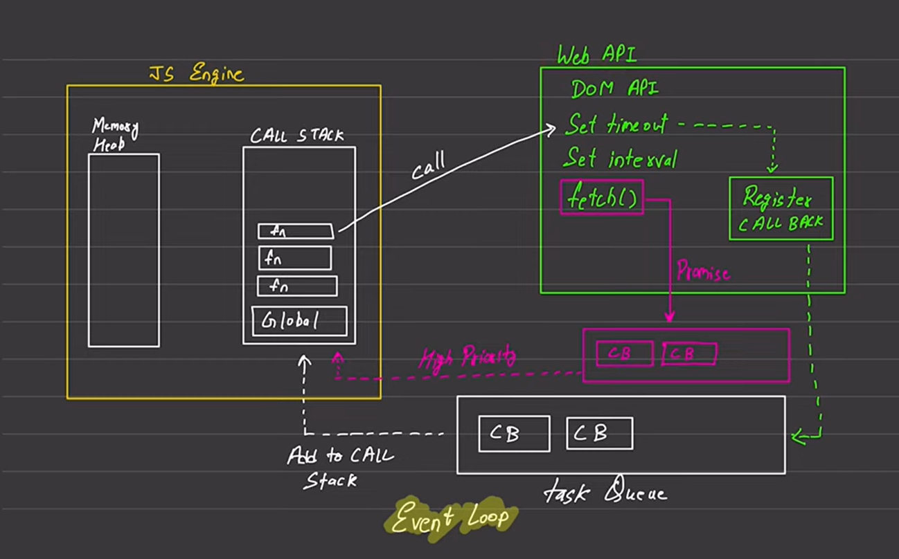

---

# 🚀 Async JavaScript Fundamentals

*(Event Loop, Call Stack, Web APIs, Promises)*

---

## 1️⃣ Why Async JavaScript Exists

JavaScript is **single-threaded**
👉 It can do **only one thing at a time**

But browsers must handle:

* Network requests
* Timers
* User clicks
* File loading

➡️ **Async JavaScript** allows JS to:

* Start long tasks
* Continue executing other code
* Handle results later

---

## 2️⃣ JavaScript Runtime Environment (Big Picture)

JavaScript runs inside a **runtime**, not alone.

### Runtime Components (from your diagram):

```
┌──────────── JS ENGINE ────────────┐
│  Memory Heap   |   Call Stack     │
└───────────────────────────────────┘

┌──────────── Web APIs ─────────────────┐
│ DOM | setTimeout | setInteral | fetch │
└───────────────────────────────────────┘

┌──── Microtask Queue (High Priority) ────┐
│ Promise callbacks                       │
└─────────────────────────────────────────┘

┌──── Callback / Task Queue ────────┐
│ setTimeout, events                │
└───────────────────────────────────┘


           🔁 EVENT LOOP
```



---

## 3️⃣ Call Stack (Heart of JS Engine)

### What is Call Stack?

* Stack data structure (LIFO)
* Executes functions **line by line**
* Only **synchronous** code runs here

### Example

```js
function one() {
  two();
}

function two() {
  console.log("Hello");
}

one();
```

### Stack Flow

```
Global
→ one()
→ two()
→ console.log
```

⚠️ If stack is busy → **nothing else runs**

---

## 4️⃣ Web APIs (Browser Power)

Web APIs are **NOT JavaScript**
They are provided by the **browser**

### Common Web APIs:

* DOM API
* setTimeout
* setInterval
* fetch
* addEventListener

### Example

```js
setTimeout(() => {
  console.log("Hello");
}, 2000);
```

### What Happens?

1. `setTimeout` goes to **Web API**
2. Timer runs in background
3. JS continues executing
4. Callback is registered for later

---

## 5️⃣ Callback Queue (Task Queue)

### What goes here?

* setTimeout callbacks
* setInterval callbacks
* DOM event callbacks

### Example

```js
console.log("Start");

setTimeout(() => {
  console.log("Timeout");
}, 0);

console.log("End");
```

### Output

```
Start
End
Timeout
```

❗ Even `0ms` timeout waits for stack to clear

---

## 6️⃣ Promises & Microtask Queue (🔥 HIGH PRIORITY)

Promises do **NOT** go to Callback Queue
They go to **Microtask Queue**

### Why?

Because promises must resolve **before normal callbacks**

---

### Promise Example

```js
console.log("Start");

Promise.resolve().then(() => {
  console.log("Promise");
});

setTimeout(() => {
  console.log("Timeout");
}, 0);

console.log("End");
```

### Output

```
Start
End
Promise
Timeout
```

---

## 7️⃣ Microtask Queue vs Callback Queue

### Priority Order:

```
1️⃣ Call Stack
2️⃣ Microtask Queue (Promises)
3️⃣ Callback / Task Queue
```

### Rule (Interview GOLD):

> **Event Loop always empties the Microtask Queue before the Callback Queue**

---

## 8️⃣ Event Loop (The Traffic Police 🚦)

### What Event Loop Does:

* Constantly checks:

  1. Is Call Stack empty?
  2. Is Microtask Queue non-empty?
  3. Is Callback Queue non-empty?

### Event Loop Algorithm (Simplified):

```text
while (true) {
  if (callStack empty) {
    if (microtaskQueue not empty) {
      move microtask to stack
    } else if (callbackQueue not empty) {
      move callback to stack
    }
  }
}
```

---

## 9️⃣ fetch() — Special Case

`fetch()`:

* Uses Web APIs
* Returns a **Promise**
* `.then()` goes to **Microtask Queue**

### Example

```js
console.log("Start");

fetch("https://api.example.com")
  .then(() => console.log("Fetched"));

console.log("End");
```

### Output

```
Start
End
Fetched
```

---

## 🔟 Visual Timeline Example (FULL FLOW)

```js
console.log("A");

setTimeout(() => console.log("B"), 0);

Promise.resolve().then(() => console.log("C"));

console.log("D");
```

### Execution Order:

```
A
D
C
B
```

### Why?

1. Sync → A, D
2. Promise → Microtask → C
3. setTimeout → Callback → B

---

## 1️⃣1️⃣ Common Interview Traps ⚠️

### ❌ Mistake

> setTimeout runs immediately if delay is 0

✅ Truth
It **always waits** for:

* Call stack
* Microtask queue

---

### ❌ Mistake

> Promises are async

✅ Truth
Promise **creation is sync**,
Promise **resolution is async**

---

## 1️⃣2️⃣ Async / Await (Syntax Sugar 🍬)

Async/await is **just promises under the hood**

### Example

```js
async function getData() {
  console.log("Start");

  await Promise.resolve("Data");

  console.log("End");
}

getData();
```

### Output

```
Start
End
```

### Internally:

```js
Promise.resolve()
  .then(() => console.log("End"));
```

---

## 1️⃣3️⃣ Real-Life Use Cases

### ✔ UI responsiveness

* Fetch data without freezing UI

### ✔ API calls

```js
await fetch(url);
```

### ✔ Animations

* Use requestAnimationFrame (Web API)

### ✔ Event delegation

* Handle many events efficiently

---

## 1️⃣4️⃣ Interview Cheat Sheet 🧠

### Core Concepts

| Concept         | Key Point          |
| --------------- | ------------------ |
| JS              | Single-threaded    |
| Call Stack      | Executes sync code |
| Web APIs        | Browser features   |
| Callback Queue  | setTimeout, events |
| Microtask Queue | Promises           |
| Event Loop      | Manages execution  |

---

### One-Line Interview Answers

**Q: Why promise runs before setTimeout?**
➡ Because promises go to **Microtask Queue (higher priority)**

**Q: Is fetch part of JS?**
➡ No, it’s a **Web API**

**Q: Who controls async execution?**
➡ **Event Loop**

---

## ✅ Final Mental Model (MEMORIZE)

> **JavaScript executes synchronous code first.
> Async tasks are handled by Web APIs.
> Promises go to Microtask Queue.
> Callbacks go to Task Queue.
> Event Loop decides what runs next.**

---

If you want next:

* 🔥 10 tricky async interview questions
* 🔁 Nested promises & starvation
* ⚙️ Node.js event loop differences
* 🧪 Predict output practice set

Just tell me 👍
